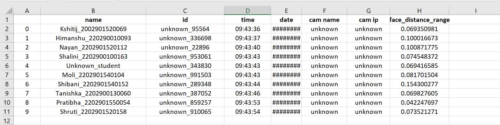

# 👥 Multi-Person Face Detection using AI 🧠🎥
## 📄 Overview
Multi-Person Face Detection using AI is a smart biometrics project designed to detect and recognize faces in real-time video footage, typically from CCTV cameras. This advanced AI system is primarily used for Smart Attendance Biometrics, accurately identifying and tracking individual students within a crowd, making it ideal for schools, colleges, and workplaces. 📸🎓

Leveraging the latest Deep Learning techniques, the project efficiently processes live video feeds, identifies faces, and matches them against a predefined database to retrieve relevant personnel information. This system automates attendance management, enhances security, and reduces manual errors, providing a seamless experience in large, dynamic environments.

## 🔑 Key Features
- 🎥 Real-Time Face Detection: Efficiently detects multiple faces in live video streams from CCTV cameras, even in crowded settings.
- 🧬 Face Recognition: Recognizes individual faces by comparing detected faces with face embeddings generated from a real-time dataset of students.
- 📝 Dataset Creation: Real-time data of college students is collected and processed into face embeddings, creating a personalized and highly accurate recognition system.
- 🧠 AI-Powered Recognition: Uses advanced algorithms for converting images into face embeddings and accurately identifying personnel amongst a crowd.
- 🌐 Flask Web Interface: The project features a user-friendly Flask web application for managing the system, viewing live attendance records, and interacting with the biometric data.
- 📦 Containerization with Docker: The entire system is containerized using Docker, ensuring smooth deployment, scalability, and easy maintenance.
## 🖥️ User Interface
Flask Web Application: The project includes a sleek and interactive Flask web app that provides an intuitive dashboard for monitoring live video streams, managing attendance records, and accessing personnel data. This makes it easy for administrators to operate the system.


## ⚙️ Tech Stack
- Python 🐍
- OpenCV 📸 (for real-time face detection and video processing)
- Flask 🌐 (for the user interface)
- Face Recognition Libraries 🧬 (for generating face embeddings)
- Docker 🐋 (for containerization)
## 🚀 How to Run the Project
1. Clone the Repository:
```git clone https://github.com/Vedant3000/Multi-Person-Face-Recognization-using-AI.git```
```cd Multi-Person-Face-Recognization-using-AI```
2. Install Dependencies:
```pip install -r requirements.txt```
3. Run the Flask App:
```python src/app.py```
Access the interface at http://localhost:5000 to start monitoring and managing attendance.
4. Creating the Docker image:
- Clone the repository
- Change the directory to the cloned repository
- Run the following command to create the docker image
    1. On Server
        - ```docker build -t Multi-Person-Face-Recognition:latest .```
    2. On Local Machine
        - ```docker build -t Multi-Person-Face-Recognition:latest -f Dockerfile.local .```
## Results Screenchots





## 📝 Dataset Creation and Processing
- Real-Time Data Collection: The dataset consists of real-time images of college students, specifically captured for creating a reliable attendance system.
- Face Embeddings: The images are converted into face embeddings, a critical step that enables accurate recognition of individuals during video processing.
## 📊 Applications
- Smart Attendance Biometrics System: Automates the attendance process by detecting and recognizing students in real-time, minimizing manual effort and errors.
- Security Enhancements: Integrates easily with existing CCTV infrastructure, providing an additional layer of security by identifying authorized personnel in restricted areas.


<!-- # Multi-Person-Face-Recognition
The project is to create a trained ML model that can perform multi-person identification in the live video feed on NVIDIA A100 DGX Server. 


We have used popular DLib and face_recognition libraries as the basis of the project 
- https://github.com/ageitgey/face_recognition


## Creating Docker Image
- Clone the repository
- Change the directory to the cloned repository
- Run the following command to create the docker image
    1. On DGX Server
        - `docker build -t Multi-Person-Face-Recognition:latest .`
    2. On Local Machine
        - `docker build -t Multi-Person-Face-Recognition:latest -f Dockerfile.local .`

## Running the Docker Image

# MPFR -->


